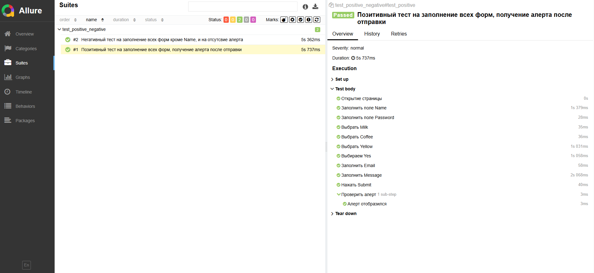
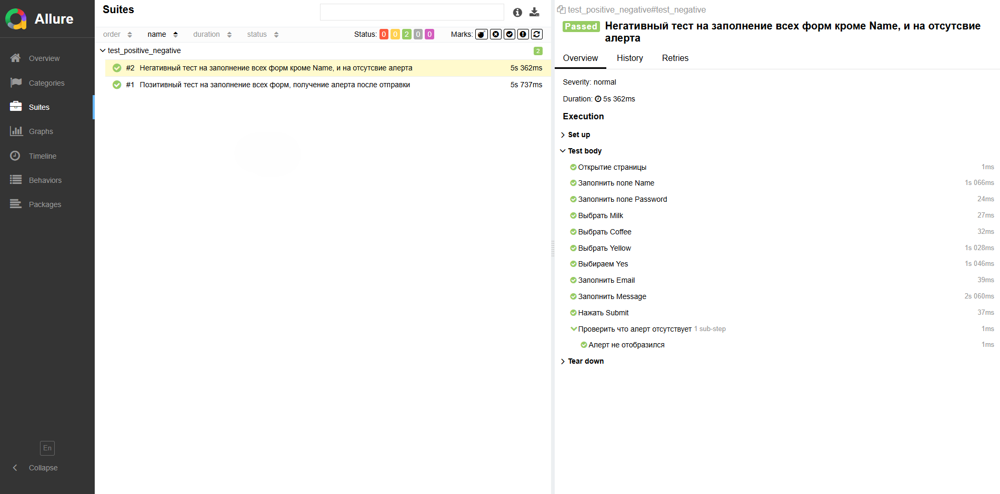
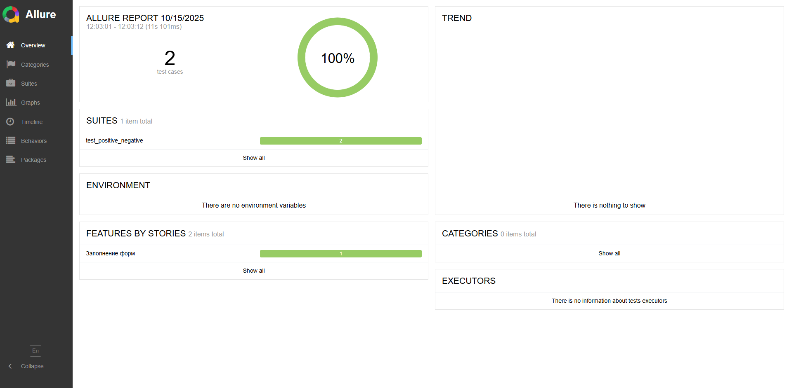

# Тестовое задание для SDET практикума SimbirSoft
## Технологии
#### Язык: Python
#### Фреймворки: Pytest, Allure, Selenium
#### Паттерны проектирования: Page Object Model, Page Factory, Fluent.

# Тест кейсы

## Позитивный тест-кейс
### Предусловие:
#### 1. Открыть браузер
#### 2. Перейти по ссылке https://practice-automation.com/form-fields/
### Шаги:
#### 1. Заполнить поле Name
#### 2. Заполнить поле Password
#### 3. Из списка What is your favorite drink? выбрать Milk и Coffee
#### 4. Из списка What is your favorite color? выбрать Yellow
#### 5. В поле Do you like automation? выбрать вариант Yes
#### 6. Поле Email заполнить строкой формата name@example.com
#### 7. В поле Message написать количество инструментов, описанных в пункте Automation tools, и написать инструмент из списка Automation tools, содержащий наибольшее количество символов
#### 8. Нажать на кнопку Submit
## Ожидаемый результат: появился алерт с текстом Message received!

## Негативный тест-кейс
### Предусловие:
#### 1. Открыть браузер
#### 2. Перейти по ссылке https://practice-automation.com/form-fields/
### Шаги:
#### 1. Оставить поле Name пустым
#### 2. Заполнить поле Password
#### 3. Из списка What is your favorite drink? выбрать Milk и Coffee
#### 4. Из списка What is your favorite color? выбрать Yellow
#### 5. В поле Do you like automation? выбрать вариант Yes
#### 6. Поле Email заполнить строкой формата name@example.com
#### 7. В поле Message написать количество инструментов, описанных в пункте Automation tools, и написать инструмент из списка Automation tools, содержащий наибольшее количество символов
#### 8. Нажать на кнопку Submit
## Ожидаемый результат: алерт не появляется, форма не отправилась

# Репорт
